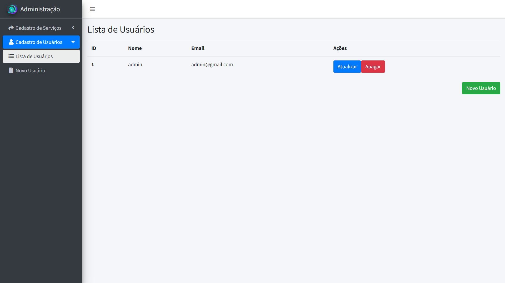

## Sistema Administrativo

Este projeto é um sistema administrativo desenvolvido com PHP utilizando o framework Laravel. Ele oferece uma interface moderna baseada no AdminLTE para o gerenciamento de usuários, serviços e recursos administrativos.

### Funcionalidades

-   Cadastro, edição e exclusão de usuários
-   Cadastro, edição e exclusão de serviços
-   Listagem de registros administrativos
-   Interface responsiva e intuitiva

